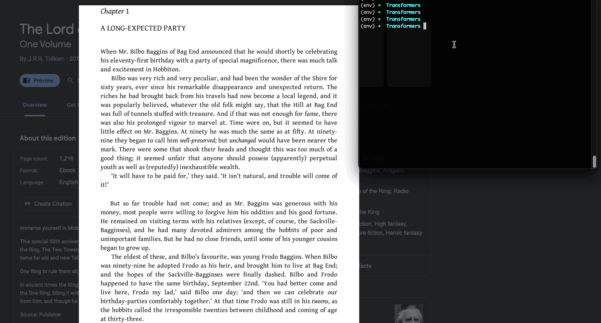

# tl;d(oc)r
Take a Screenshot of long text ----> Output a short summary

Utilize OCR on a screenshot to feed the captured text into a summarization convolutional neural network.



## Requirements

Mac OS (xcode)

Will need to Install [macOCR](https://github.com/schappim/macOCR) (Tesseract).

Install via Homebrew

```
brew install schappim/ocr/ocr
```

or Install via Curl

``` 
curl -O https://files.littlebird.com.au/ocr-EPiReQzFJ5Xw9wElWMqbiBayYLVp.zip; 
unzip ocr-EPiReQzFJ5Xw9wElWMqbiBayYLVp.zip;
sudo cp ocr /usr/local/bin; 
```

## Setup

Install and run within virtual environment:

```
python3 -m venv env
source env/bin/activate
python3 pip install -r requirements.txt
```

Note: First run of the model will take time to download CNN model.
Can take few minutes to download and few GB for space needed.

## USE

Make sure you are in the project directory, then from command line run:

```
./ocr-shell.sh
```

Upon change to screenshot cursor: click, hold, and then drag over text you wish to input. 

Release the mouse to finalize capture of the screenshot.
